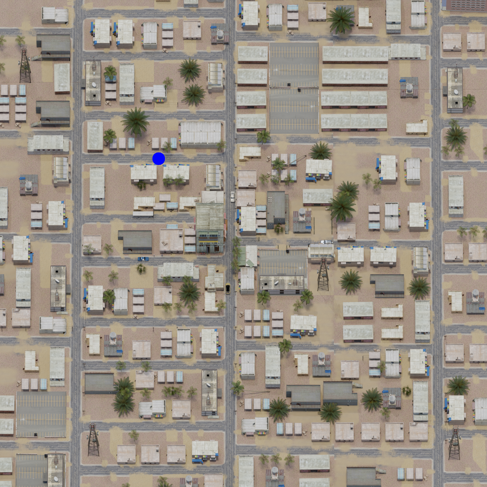
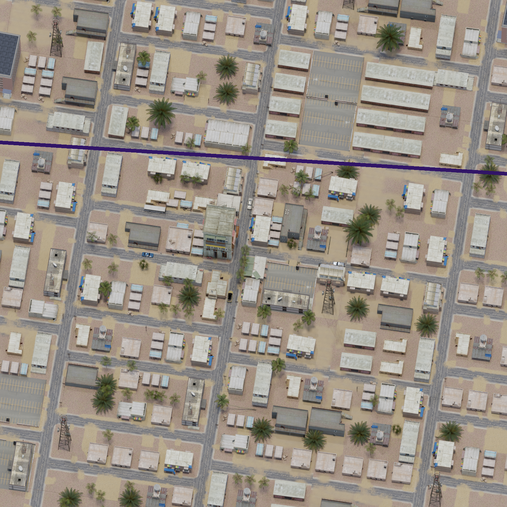
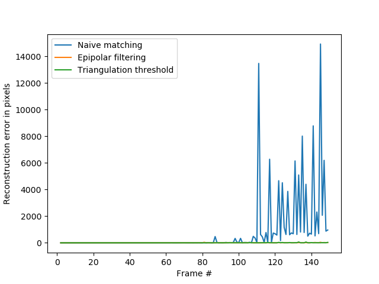
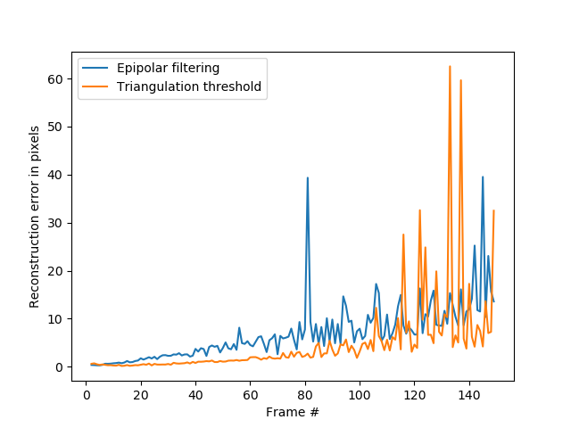

# Drone image matching via visual odometry, epipolar filtering and triangulation thresholding

## Problem
Goal is to perform accurate **image matching** for drone images. Image matching considered here refers to **dense matching**, where a system should match each pixel in **query image** to a pixel in the **reference image**.

There are multiple ways to solve this task, including:
- **Dense optical flow** : optical flow is iteratively calculated via a deep learning method as the drone navigates the environment.
    - **Pros**: Accurate for small baselines.
    - **Cons**: Can not handle occlusions, expensive, error accumulates over time.
- **3D reconstruction**: the system estimates 3D reconstruction of the environment via a real-time NeRF or a Multi-view stereo method. Image points from query image can then easily be reprojected to a reference image, establishing correspondence.
    - **Pros**: Easily handles occlussions, parallax due to building heights.
    - **Cons**: Not suitable for embedded real-time performance, slightly overkill (we do not explicitly need 3D sutructure), prone to triangulation (depth) noise.
- **Homography estimation**: pixels are matched by estimating the homography between ground planes in query and reference image.
    - **Pros**: Cheap, robust due to RANSAC correspondence matching, highly accurate for all baselines if correspondences are correct.
    - **Cons**: Can not handle parallax (assumes that everything is on the ground-plane, which distors matching for buildings), reliance on accurate correspondence matching. 

This repository implements a simple **POC** solution for **matching via homography estimation**. It simulates noise from the **Visual Odometry**, as in real-time system this would be performed within the VO pipeline.

## Requirements
- Python
- NumPy
- OpenCV

## Method
Homography can be robustly estimated from established image correspondences calculated with ORB descriptors. Given 2D image coordinates pairs $(x_q, x_r)$ from query and reference image, homography is the perspective transformation $H$, satisfying the constraints $x_q^i = H x_r^i, \forall i$. Unfortunately, due to noisy correspondences, this can not be solved exactly, which is why $H$ is estimated by minimizing the L2 error via **Direct Linear Transform** and **RANSAC** in order to filter the outliers.

### Epipolar filtering
However, a high percentage of outliers makes the estimation intractable. In our scenario, high percentage of outliers is present due to repetitive structures and wide baselines. Epipolar constrain can be used to choose correspondences which satisfy the **epipolar geometry**:

$$x_1^TK^{-T}EK^Tx_2 = 0,$$
$$E = [t]_{\times}R$$
where $t$ and $R$ are translation and rotation estimated by Visual Odometry, respectively. For each point in query image, the correspondence must lie on the **epipolar line**, as depicted below:

 Figure: Point and the corresponding epipolar lines 

This enables filtering of inaccurate ORB matches not satisfying the epipolar constriant:

 Figure: Matches beforea and after epipolar filtering 

Without epipolar filtering, homography estimation diverges for wider baselines due to outlier matches induced by repetitive structures:

### Triangulation thesholding
Homography is a projective transformation satisfied only for **planar surfaces**. To that end, matches not on the ground-plane have the negative effect on the resulting homography. As the goal of the project is to enable matching for objects of smaller height like cars, we introduce **triangulation thresholding**. Matches are triangulated via **DLT** algorithm, and filtered out if the height is above the certain threshold. This improves the reconstruction error as depicted below:

### Incremental estimation
Despite the highly robust estimation, the estimation starts to jitter after a certain relative camera translation due to the low amount of inliers, as depicted below:

To that end, $H$ is estimated incrementally, by chaining the estimated homographies. This can be easily done within an existing VO pipeline.

